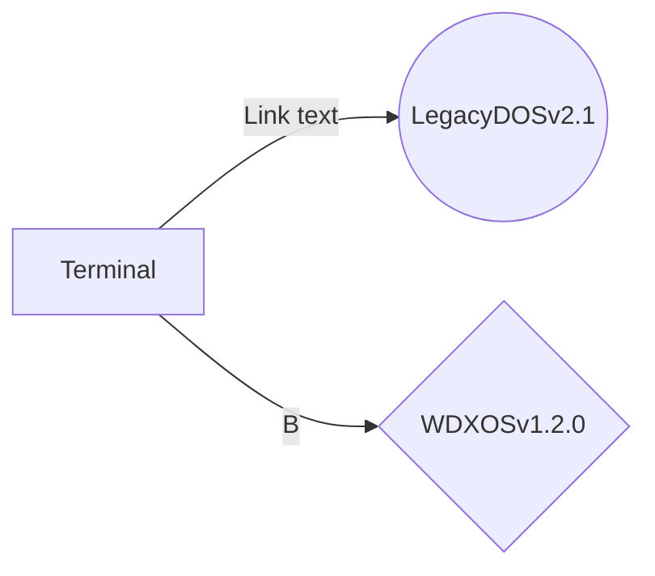

## Welcome to WDXOS

## What is it?
Basically, in very short words, a MSDOS clone.

## How it works
This is how it works

## Plans

-Mp3 support
-Support with every console based OS.(able to run their executables)
-Formatting folders and entire Root folders support.
-Ip config support
-Online Terminal Support (use a variatey of Online Programs built in python.)
- Raw Python, Java, Or LUA console support
- Fake Mock Shell support
- Better file support(Rename, Return to root folder, ETC)
- Better error handling 
- https://en.wikipedia.org/wiki/List_of_DOS_commands <--- anything from here

## The team behind it - WaterDeluxeTeam
By ElisWorldStudios
